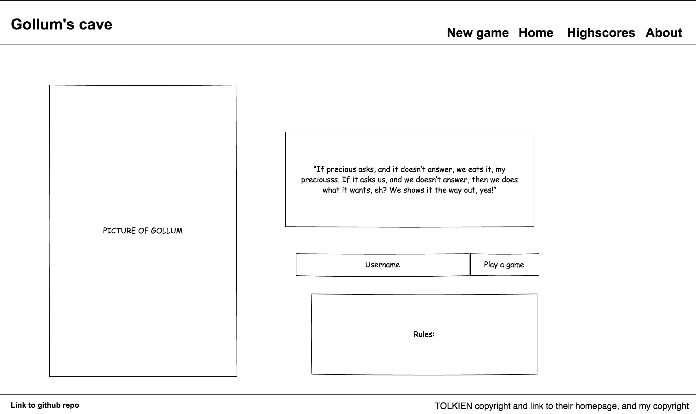
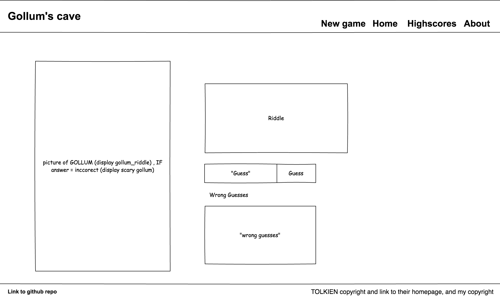
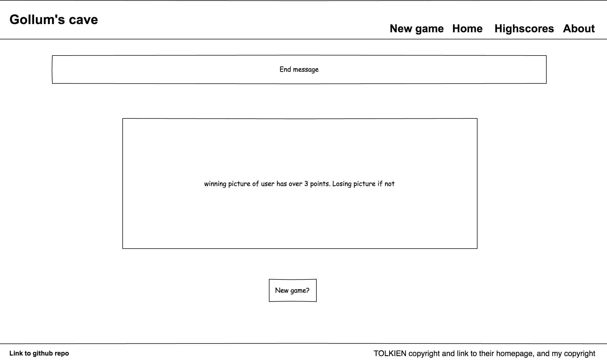

# Gollum's Cave

You can access the deployed web app [here](https://gollums-cave.herokuapp.com)

This is a python3 and Flask riddle game app based on the encounter bewteen the creature Gollum and Bilbo Baggins, the hero of J.R.R Tolkien's "The Hobbit".

This is the 3rd milestone project, required for completing the code institute's full stack web development course.

## User experience 

This website is designed for fans of J.R.R Tokien's work (i.e: author of The hobbit, Lord of The Rings, The Silmarillion, e.t.c) to live through Bilbo's meeting with Gollum. Just as in the book, players will attempt to escape from Gollum by answering his riddles correctly. The aim of this project was to create a flask based riddle game, to showcase skills in the use of Python3, flask and front-end design.

Below you can read some of the user stories:

* As a user, I want to play a riddle game that allows me to compete with friends.
* As a user who doesn't know about the background of the story, I want to be able to learn more about it.
* As a fan of The Hobbit, I want the game to feel like being in the cave under the Misty Mountains.

Below you can see the wireframes:

## Features

The main feature of this application is the riddle game. The game is simple: players will be shown 5 riddles and must answer more than 3 correctly to win. Players will be given 3 attempts per riddle, then the player loses the opportunity to get that point and the next riddle is displayed. After all riddles have been  responded to the player's score and username will be submitted to the highscore board. 
All correct answers should be: all lowercase, one word and singular (i.e: non plural)

The layout for each page can be seen [above](#wireframes) in the wireframes.

Below you can find a summary of a player's game: 

1. Once the user has read the welcome message and the rules, they can submit a username to start. 
2. They will then be taken to the riddle page, where each riddle is displayed
3. Players answer the riddle by typing their answer in the box (below the riddle): 
   * **If correct**: The gollum picture remains the same and a message appears ("Correct answer x. Your score is x")
   * **If incorrect**: A menacing picture of Gollum is displayed, your incorrect guess is displayed below the riddle input, you loose one of your 3 attempts and a message appears ("Wrong answerx. You have x remaining attempts left")
   * If the player looses all their 3 guesses, a message is displayed ("Wrong answer, x. Better luck with this riddle:") and the next riddle is shown
> Note: The user's 3 guesses reset after that and the picture of Gollum returns to normal  
4. When all 5 riddles have been answered, the player is taken to a new page where a congratulations message is shown ("Congratulations x, you've completed the game! Your final score is x. Check the highscore board to see where you are"). 
   * If the player scored more than 3: you escaped with the ring (so a picture of the one ring is displayed, this is the winnning picture)
   * If the player scored 3 or less: you were captured/eaten by Gollum (so an excited picture of Gollum is displayed, this is the losing picture)
     
Players can then view the highscore board by clicking the link in the head navigation bar. Highscores are displayed highest to lowest, and newest to oldest. Thus if 2 players score 5, the last one to submit their score would be displayed above the other.

> Note: This project does not use a database. The riddles and answers are stored in JSON file, but the players: username, final score, attempts, wrong-answers, e.t.c are stored as session variables. Therefore each time the broswer is closed the heighscore board will be emptied. 
 

## Technologies Used

#### Front-end

[Fonts awesome](https://fontawesome.com):
* Provide the icons for the project 

[Bootstrap](https://getbootstrap.com/docs/4.0/getting-started/introduction/) (4.0.0):
* Provides a grid system to structure html code and basic css styling

[JQuery](https://jquery.com)(3.2.1):
* Provides DOM manipulation

[Jinja2](http://jinja.pocoo.org/docs/2.10/) (2.10):
* Used to render data/variables from the main app (run.py) 

#### Back-end

[Python3](https://www.python.org/download/releases/3.0/) (3.4.3):
* Used to write the logic for this app (which can be seen in [run.py](https://github.com/brookk16/gollums-cave/blob/master/run.py))

[Flask](http://flask.pocoo.org) (1.0.2):
* Acts as a framework for the app

The code editor used to create the project was [Cloud9](https://c9.io/signup).

The project uses [Git](https://git-scm.com) for version control.

For the additional tools and libraries needed to run the app, please refer to [requirements.txt](https://github.com/brookk16/Cuisine/blob/master/requirements.txt)

## Testing

User stories

 
User stories were checked to ensure this project meets their requests:

* The site allows multiple people to play at once and then submits their scores (and rank), therefore allowing users to compete.
* For users who are unaware of the story, there is an about page describing the characters and the event.
* The game is designed to feel as though you are in the cave with Gollum (the changing pictures help bring the game to life)

Manual Testing

 
Manual testing was conducted on all main features of the app (features outlined [here](#features)).

> note: all tests begin by starting at the index/welcome page.

> note: all tests are from the desktop perspective. For mobile, any references to a "nav bar", will require clicking on the "ring" symbol first to reveal the menu (screen sizes < 575px).

The first tests checked that all the templates were rendering correctly across all screen sizes, no errors were found.

The rest of the tests consisted of checking the riddle function and highscore board features of the app:

**Riddle app testing**

1. **If user answers all riddles incorrectly**
   * User begins by adding a username (ex: user 1)
   * User answers all 5 riddles the same way, using the answer "x" (this is submitted 3 times per riddles to use all 3 attempts)

   * Each time a riddle was answered incorrectly the picture changed to a menacing picture of Gollum and the correct message displayed.
   * When all riddles were answered the user was taken to the game over page where the losing picture was displayed along with the correct losing message.
   * Then used the "Highscores" link in the nav, where user 1 was displayed along with a rank of 1 (currently being the only entry)
> Note: The "Wrong guesses" functionality was also tested and resets the 3 attempts after each new riddle is displayed.

2. **If user answers 3 or less**
   * Followed same pattern as test 1 (using user 2)
   * **Except** answered riddles 1,2 and 3 correctly
   * User was taken to the game over page where the losing picture was displayed along with the correct losing message.
   * The highscore board showed user 2 with rank 1 (above user 1 in rank 2) and a score of 3
> Note: The same results are shown for users who only answer 1 or 2 of the riddles correctly 

3. **If the user answers 4 or more correclty**
   * Followed the same pattern as test 1 (using user 3)
   * **Except** answered all riddles correctly
   * When all riddles were answered correctly, user 3 was taken to the game over page and saw a congratulations message along with the winning picture.
   * On the highscore board, user 3 was now ranked 1 (with user 2 in rank 2 and user 1 in rank 3) with a score of 5.

The highscore board capacity was also checked, and no more than 11 entries are displayed on the page. Thereofore if a 12th user submits their score, it will only be displayed on the highscore board if their score is greater than the score at the 11th place. However, if the score at rank 11 is equal to the score submitted by the user, the newer score sill be displayed. So even though the user at rank 11 and the new user may have 0 points, the new user will replace the user at rank 11.

Further testing and Issues

 
1. HTML and CSS code were both validated using W3C [HTMl](https://validator.w3.org) and [CSS](https://jigsaw.w3.org/css-validator/) validator.

> note: HTML validation threw up errors, although these were concerning the Jinja2 templating language used in the html templates.

Issues:

* As no database is being used, user info is not being saved. Therefore users cannot "reserve" usernames, and usernames may be doubled. However, due to the simple nature of the riddle game I did not feel such features were required.
* The author is not yet skilled in automated testing, and as such was unable to adhere to a test driven development approach. 

## Deployment

The project is deployed on Heroku, and can be accessed [here](https://gollums-cave.herokuapp.com) 

The Github for this project can be found [here](https://github.com/brookk16/gollums-cave). And can also be accessed via the github logo in the footer of the website.

Download the code from github, and place into your project. 

Or clone the project into your working environment, using the command line:

~~~
git clone https://github.com/brookk16/gollums-cave
~~~

> Note: You will require a Github repository, if you are new to Github, please follow the link [here](https://github.com) for more infomation.

To deploy to Heroku:

1. Login to [Heroku](https://www.heroku.com) or create an account
2. Create an app
3. Go back to your IDE and add paste in the command to connect this Heroku app to your Github repository (Below "Existing Git repository")
4. Make sure you have your code pushed to Github
5. Then you can push your code to Heroku.
~~~
git push heroku master
~~~

You can also connect your Github repository to Heroku, so that each time you push to Github it goes to Heroku.
* Go to Heroku 
* Deploy 
* Click on "Github" as the  "Deployment method" 
* "Enable automatic deploys" 
* Then click on "Deploy" to deploy your project 

## Credits

#### Content

The fonts used were taken from [thehut](http://www.thehutt.de/tolkien/fonts.html)

The photos used in this site were obtained from [Google images](https://www.google.com/search?rls=en&q=google+images+Gollum&tbm=isch&source=univ&client=safari&sa=X&ved=2ahUKEwjjztKioJHhAhWYTBUIHXriCmwQsAR6BAgJEAE&biw=1440&bih=769)

#### Acknowledgements

I received inspiration for this project from the works of J.R.R Tokien. Please see [middle-earth](https://www.middleearth.com) for more information.